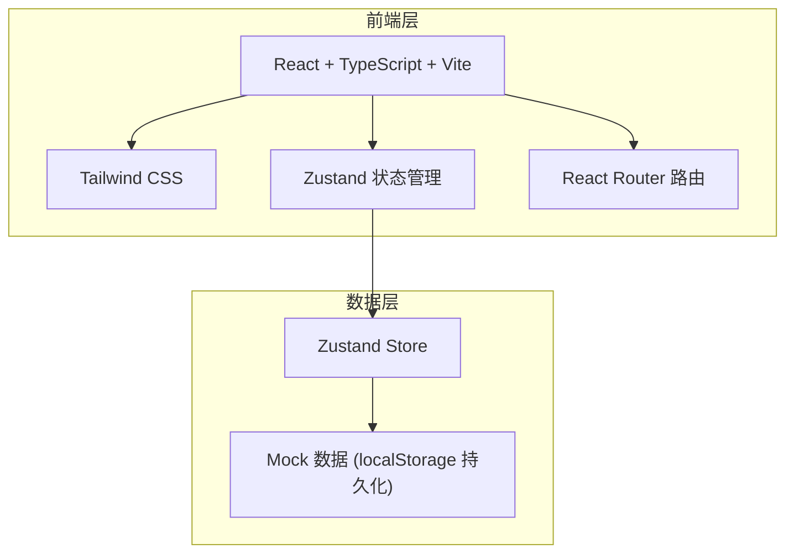
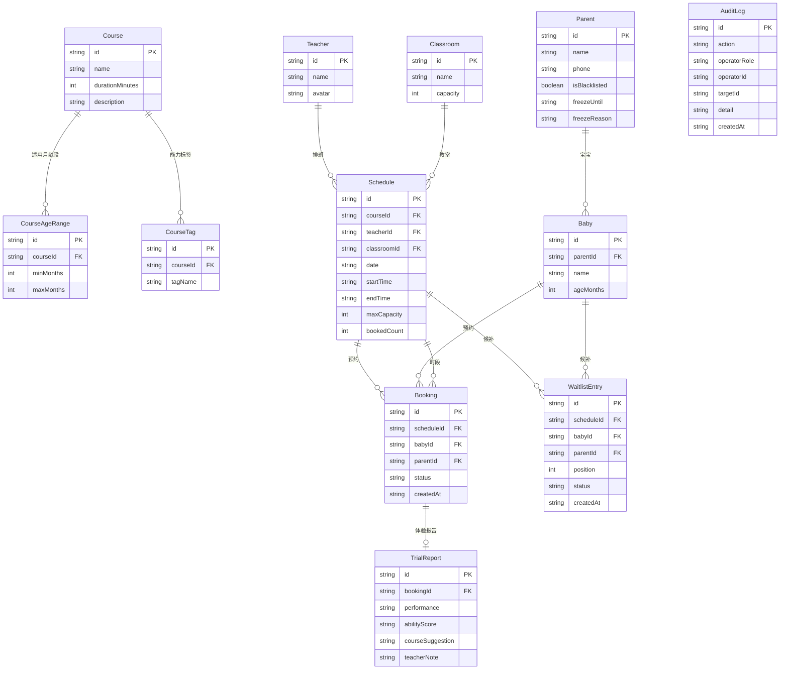

## 1. 架构设计



纯前端方案，使用 Zustand 管理全局状态，localStorage 持久化数据，不依赖后端服务。所有业务规则在前端 Store 层实现。

## 2. 技术说明

- **前端**：React@18 + TypeScript + tailwindcss@3 + vite
- **初始化工具**：vite-init（react-ts 模板）
- **后端**：无（纯前端，Mock 数据）
- **数据库**：localStorage（浏览器持久化）
- **状态管理**：Zustand
- **路由**：react-router-dom@6
- **图标**：lucide-react

## 3. 路由定义

| 路由 | 用途 |
|------|------|
| `/` | 角色选择入口页 |
| `/consultant` | 顾问工作台首页 |
| `/consultant/courses` | 体验课管理 |
| `/consultant/schedule` | 老师排班与教室容量 |
| `/consultant/waitlist` | 候补队列管理 |
| `/consultant/funnel` | 转正漏斗与跟进 |
| `/consultant/rules` | 频次限制与黑名单 |
| `/consultant/audit` | 操作审计日志 |
| `/parent` | 家长预约首页 |
| `/parent/book` | 选择课程和时段预约 |
| `/parent/status` | 预约状态查看 |
| `/teacher` | 老师名单首页 |
| `/teacher/roster` | 试听名册 |
| `/teacher/report` | 体验报告 |

## 4. 数据模型

### 4.1 数据模型定义



### 4.2 核心状态切片（Zustand Store）

```
useCourseStore      → 课程、月龄段、能力标签
useScheduleStore    → 老师排班、教室容量
useBookingStore     → 预约、候补、频次校验、爽约冻结
useParentStore      → 家长信息、黑名单、冻结
useReportStore      → 体验报告
useFunnelStore      → 转正漏斗、跟进记录
useAuditStore       → 操作审计日志
```

### 4.3 业务规则引擎

| 规则 | 触发时机 | 处理逻辑 |
|------|----------|----------|
| 年龄匹配校验 | 家长提交预约 | 比对宝宝月龄与课程月龄段，不匹配弹出警告但允许继续 |
| 手机号频次限制 | 家长提交预约 | 检查该手机号本周是否已有预约，有则拒绝 |
| 黑名单拦截 | 家长提交预约 | 检查手机号是否在黑名单，是则拒绝 |
| 爽约冻结 | 老师标记爽约 | 自动冻结该手机号 N 天，冻结期间无法预约 |
| 重复档案合并 | 家长输入手机号 | 查找相同手机号的宝宝档案，弹出合并提示 |
| 满员候补 | 家长提交预约但名额满 | 自动加入候补队列，返回候补位置 |
| 候补自动转正 | 有人取消或爽约 | 候补队列首位自动转正为正式预约 |
